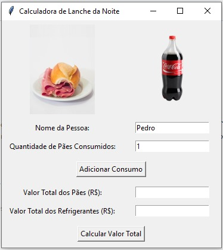
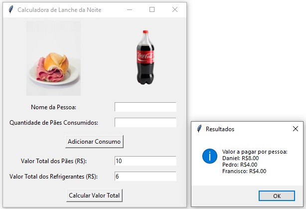

# Descrição:

Este aplicativo Python permite calcular o valor a pagar por pessoa em um lanche da noite, considerando o consumo individual de pães e refrigerantes.

# Como executar:

Instale o Python 3.x no seu computador.
Baixe o arquivo `pao.py` ou `pao.pyw` caso já tenha o python instalado no seu computador e só queira executar.
Nesse segundo caso, você só precisa executar o arquivo de formato `.pyw`.
Agora, seguindo para a primeira opção, para acessar o código e posteriormente executar o programa dentro de uma IDE, 
abra um terminal ou prompt de comando e navegue até a pasta onde o arquivo foi baixado. 

`Utilize "dir" para localizar a pasta atual dentro da IDE ou "cd + nome da pasta" para navegar entre pastas casonão esteja  no mesmo local do arquivo`

Digite o seguinte comando para executar o aplicativo:

`python pao.py`

Use o código com cuidado.

# Funcionalidades:

Adicionar consumo: Digite o nome da pessoa e a quantidade de pães que ela consumiu. Clique em `"Adicionar Consumo"` para registrar o consumo.
Calcular valor total: Digite o valor total dos pães e dos refrigerantes. Clique em `"Calcular Valor Total"` para exibir o valor a pagar por pessoa.

# Observações:

O aplicativo considera que todos os pães têm o mesmo valor.

O aplicativo considera o valor total gasto em refrigerantes.

# Exemplo:

<h3>Nome da Pessoa: Daniel</h3>

<h3>Quantidade de Pães Consumidos: 3</h3>

<h4>#Adicione o nome e a quantidade de pães que a pessoa comeu, clicar em "Adicionar Consumo" e adicionar quantas pessoas você quiser na lista.</h4>

<h1></h1>

<h3>Nome da Pessoa: Pedro</h3>

<h3>Quantidade de Pães Consumidos: 1</h3>

<h1></h1>

<h3>Nome da Pessoa: Francisco</h3>

<h3>Quantidade de Pães Consumidos: 1</h3>

<h4>#Caso não queira mais adicionar pessoas na lista, ir para as opções de baixo:</h4>

<h1></h1>

<h3>Valor Total dos Pães(R$): 10 e do Refrigerante(R$): 6</h3>

<h4>#adicionar o valor dos pães que vai ser dividido perante a quantidade de pães que cada pessoa comeu e o valor do refrigerante que vai ser dividido igualmente pelas pessoas e clicar em "Calcular Valor Total" para ver o resultado da lista</h4>

# Divirta-se!!
